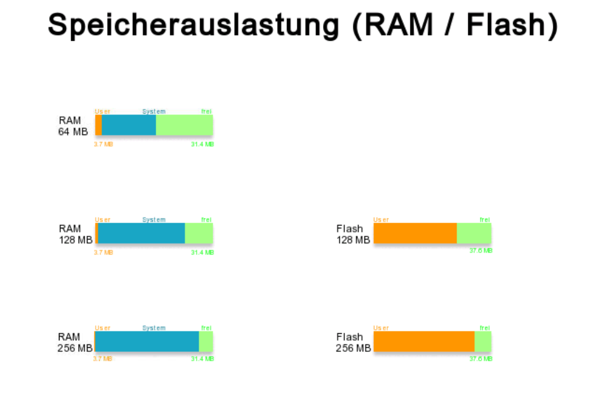
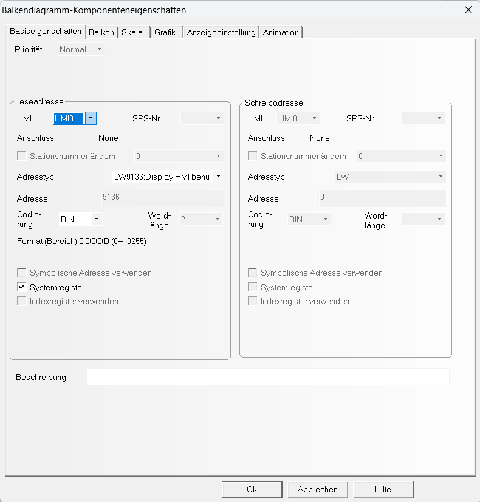
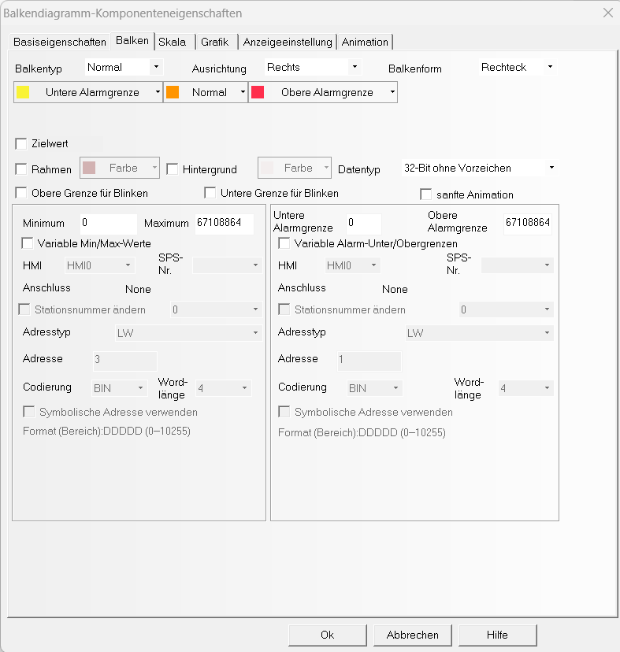
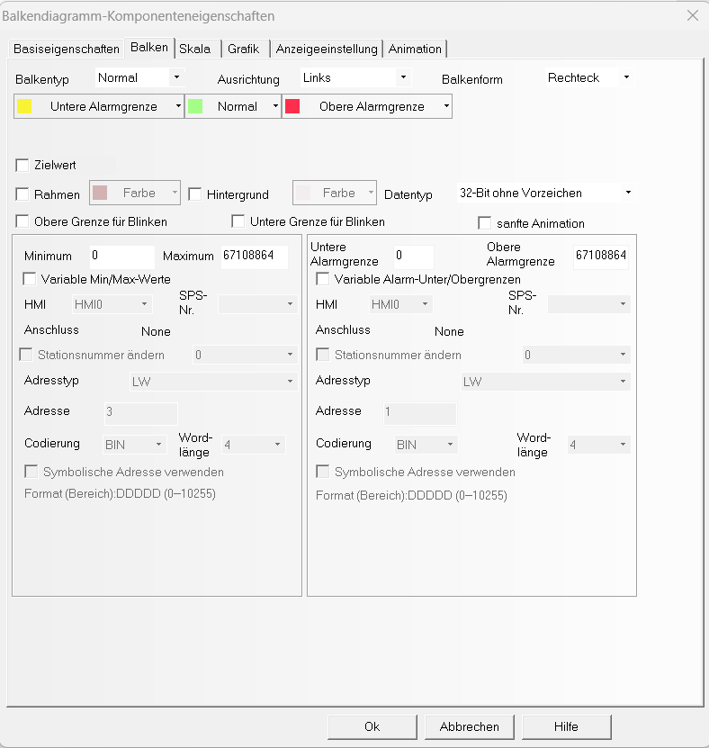
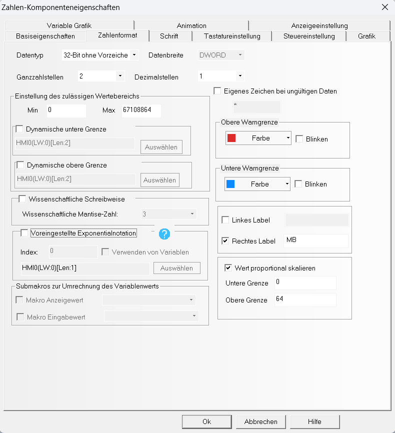

# Sammlung nützlicher freier Kinco DTools Komponenten von spstiger

Hier folgt die Erklärung

- Screenshots Projekt und Komponenten

- Variablen erklärt

- Aufbau Balkendiagramm erklärt - RAM und Flash

- Import der Bibliothek erklärt

## Komponente – Speicherauslastung (RAM / Flash)

Diese Komponente visualisiert die Speicherauslastung (RAM und Flash) eines beliebigen Kinco-HMI-Geräts.  
Das Beispiel wurde auf einem **MK070E** erstellt, ist aber auf andere Modelle übertragbar.

### Aufbau

Im **Fenster 0 (Hauptfenster)** werden fünf Elemente angezeigt, die die Speicherbelegung unterschiedlicher HMI-Modelle darstellen:

- **RAM:** 64 MB, 128 MB, 256 MB

- **Flash:** 128 MB, 256 MB

Jedes Element zeigt grafisch die Belegung des Speichers durch den Benutzer, das System und den noch freien Bereich.

---

### Funktionsprinzip

#### 1. RAM-Anzeige

Beim Erstellen eines Projekts in Kinco DTools ist zu beachten, dass **Bilder, Tabellen, Schriftarten und grafische Komponenten** den verfügbaren **RAM-Speicher** beeinflussen.  
Das HMI lädt beim Start alle benötigten Ressourcen in den Arbeitsspeicher,  
um eine flüssige Darstellung und schnelle Reaktionszeit zu gewährleisten.

Je mehr grafische Elemente oder große Bitmaps verwendet werden,  
desto mehr RAM wird belegt – unabhängig von der Gerätegröße (z. B. 64 MB, 128 MB oder 256 MB).

### Typische Speicherverbraucher:

| Elementtyp                                     | Beschreibung                                                 | Einfluss auf RAM                                       |
| ---------------------------------------------- | ------------------------------------------------------------ | ------------------------------------------------------ |
| **Bilder / Bitmaps**                           | Hintergründe, Icons, Logos, Farbverläufe                     | 🔺 Hoch – werden vollständig in den RAM geladen        |
| **Tabellen / Data Tables**                     | enthalten Datensätze wie Rezepte oder Parameterlisten        | 🔺 Mittel bis Hoch                                     |
| **Schriftarten (Fonts)**                       | jede neue Schriftart oder Größe belegt zusätzlichen Speicher | 🔺 Mittel                                              |
| **Makros / Scripts**                           | Steuerlogik oder interne Abläufe                             | 🔺 Gering bis Mittel                                   |
| **Balkendiagramme, Zeigerinstrumente, Trends** | grafische Elemente mit Animation oder Aktualisierung         | 🔺 Mittel                                              |
| **Kommunikationsvariablen**                    | häufig aktualisierte Modbus-Register                         | 🔺 Gering, aber bei vielen summiert sich der Verbrauch |

Für die Anzeige des benutzten und freien RAM-Speichers werden **Balkendiagramme** und **Zahlenkomponenten** mit **Systemvariablen** kombiniert.

- **Benutzter RAM (User):**

- **Systemregister:** LW9136

- - **Datentyp:** 2 Words (32 Bit ohne Vorzeichen)
  
  - **Ausrichtung:** *Rechts* (Balken wächst nach links)
  
  - **Wertebereich (Beispiel 64 MB):**
    
    - **Minimum:** 0
    
    - **Maximum:** 64 MB × 1024² = 67 108 864 Byte

 

 Für andere Modelle:

| RAM-Größe | Maximalwert (Bytes) |
| --------- | ------------------- |
| 64 MB     | 67 108 864          |
| 128 MB    | 134 217 728         |
| 256 MB    | 268 435 456         |

- **Freier RAM:**
  
  - **Systemregister:** LW9134
  
  - **Datentyp:** 2 Words (32 Bit ohne Vorzeichen)
  
  - **Ausrichtung:** *Links* (Balken wächst nach rechts)

Beide Balkendiagramme werden **übereinander auf einer Bitmap-Komponente** platziert, die den vom System genutzten Speicherbereich darstellt.  
So entsteht eine dreifarbige Gesamtanzeige:

- **Orange:** vom Benutzer belegter RAM

- **Blau:** vom System belegter RAM

- **Grün:** freier RAM

Zur besseren Lesbarkeit sind unterhalb des Diagramms **Zahlenkomponenten** angeordnet:

- LW9136 → belegter RAM (User)

- LW9134 → freier RAM

#### Skalierung der Zahlenkomponenten

Damit die Werte leicht ablesbar sind, werden die **Zahlenkomponenten skaliert**, um nicht die Byte-Zahl, sondern den **Speicher in Megabyte (MB)** darzustellen.

- **Skalierung für 64 MB-Gerät:**
  
  - **Unterer Wert:** 0
  
  - **Oberer Grenzwert:** 64

- **Skalierung für 128 MB-Gerät:**
  
  - **Unterer Wert:** 0
  
  - **Oberer Grenzwert:** 128

- **Skalierung für 256 MB-Gerät:**
  
  - **Unterer Wert:** 0
  
  - **Oberer Grenzwert:** 256

Damit zeigen die Zahlenkomponenten den aktuellen RAM-Stand in **Megabyte** an – z. B. „27.4 MB frei“ oder „12.8 MB belegt“.

---

#### 2. Flash-Anzeige

Im Gegensatz zum RAM hat der Flash **keinen eigenen Systemspeicheranteil**.  
Das bedeutet: das Betriebssystem und die HMI-Runtime **nutzen den Flash nicht aktiv** während des laufenden Betriebs,  
sondern nur zum **Speichern oder Laden von Dateien**.

Der **freie Flashspeicher** wird über das **Systemregister LW9036** dargestellt.  
Da Kinco-HMIs in der Regel nur **128 MB oder 256 MB Flash** besitzen, gibt es hier nur zwei Varianten.

- **Zahlenkomponente:** zeigt verbleibenden Flashspeicher (in MB)

- **Balkendiagramm:** visualisiert belegten Flashbereich
  
  - Liegt auf einer Bitmap-Komponente, die den gesamten Flash-Speicher symbolisiert

---

### Hinweise zur Anpassung

- Alle Adressen (LW9134, LW9136, LW9036) sind **systemweit gültig**.

- Die Farben können nach Belieben im Balkendiagramm-Editor geändert werden

## Eigene Komponentenbibliothek erstellen und verwenden

So erstellt ihr eine eigene Komponentenbibliothek:

[Anleitung zur Bibliothek](./bibliothek_export.md)
