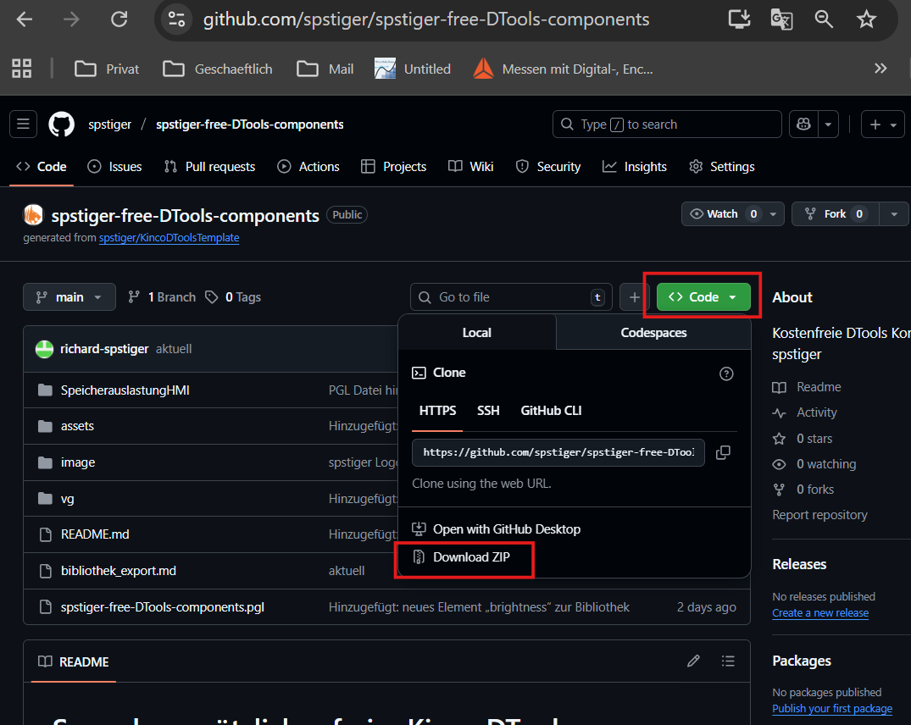

# automatische Aktualisierung des Repositories

Zu erst muss das Repository **„spstiger-free-DTools-components“** manuell als ZIP-Datei des GitHub heruntergeladen werden.  
So erhält man die aktuelle Version der spstiger-Komponenten direkt von GitHub.

#### Repository herunterladen

1. **GitHub öffnen**  
   Besuche die Seite des GitHub-Benutzers **spstiger**:  
   [spstiger (spstiger) · GitHub](https://github.com/spstiger)

2. **Repository auswählen**  
   In der Liste der Repositories das Projekt  
   **`spstiger-free-DTools-components`** öffnen.
   
   

3. **Download starten**  
   Im Repository oben rechts auf den **grünen Button „Code“** klicken.

4. **ZIP-Datei herunterladen**  
   Im Menü **„Download ZIP“** auswählen.  
   Der Download startet automatisch (meist in den Ordner **Downloads**).
   
   

5. **Datei entpacken (extrahieren)**  
   Nach dem Herunterladen die ZIP-Datei z. B. mit Rechtsklick →  
   **„Alle extrahieren…“** entpacken.  
   Es entsteht ein Ordner, z. B.:
   
   `C:\Users\<Benutzername>\Downloads\spstiger-free-DTools-components-main`

6. **Ordner in Kinco DTools verwenden**  
   Den entpackten Ordner anschließend nach folgendem Pfad kopieren:
   
   `C:\Kinco\Kinco DTools V4.x.x.x_xxxxxx\usrlib\`
   
   
   
   *Hinweise*
   
   - *Der Ordner **`usrlib`** ist **von Kinco fest vorgegeben** – er darf **nicht verschoben oder umbenannt** werden.*
   
   - *DTools sollte **geschlossen** sein, während die Verknüpfungen erstellt oder gelöscht werden.*

7. **In DTools prüfen**
   
   1. DTools starten
   
   2. Rechtsklick auf freie Fläche → **Eigene Komponenten → Eigene Komponenten nutzen**
   
   3. In der Liste die Bibliothek **„spstiger-free-DTools-components“** auswählen
      
      
   
   Die Komponenten stehen nun direkt zur Verfügung.

#### Aktualisierung über GitHub Desktop

Wenn neue Elemente veröffentlicht werden:

1. In **GitHub Desktop** → **Fetch origin** (oder **Pull**)
   
   

2. DTools neu starten

3. Neue oder geänderte Elemente sind sofort verfügbar

##### Kein Export/Import mehr erforderlich

# 
