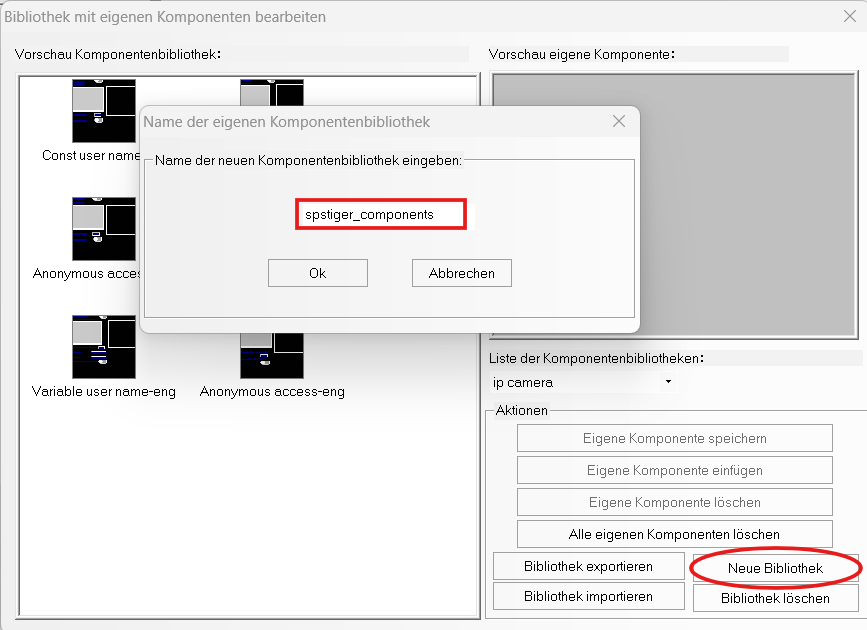
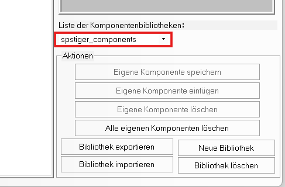
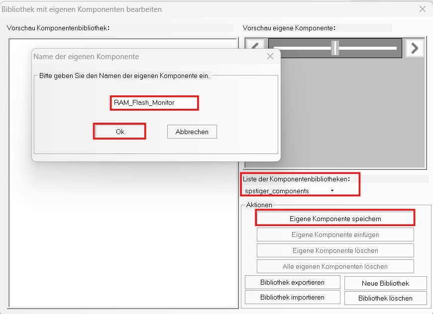

# Eigene Komponentenbibliothek erstellen und verwenden

Kinco DTools enthält bereits eine **Standardbibliothek** mit vordefinierten Komponenten.  
Diese sollte **nicht verändert oder überschrieben** werden.  
Um eigene, benutzerdefinierte Elemente zu speichern (z. B. selbst erstellte Speicheranzeigen oder Visualisierungskomponenten),  
empfiehlt es sich, eine **eigene Bibliothek** anzulegen.

---

### 1. Voraussetzungen

Bevor eine Komponente gespeichert werden kann, müssen alle zugehörigen Elemente im HMI-Projekt **fertig aufgebaut und korrekt positioniert** sein (z. B. Balkendiagramme, Zahlenkomponenten, Texte).

---

### 2. Elemente gruppieren

1. Alle zugehörigen Elemente markieren

2. Mit **Strg + G** oder per Rechtsklick → **„Gruppieren“** auswählen

3. Die markierten Objekte werden zu **einem einzigen Element** zusammengefasst

> Gruppieren ist notwendig, damit DTools die Objekte als eine Einheit behandelt und sie später als komplette Komponente speichern kann.

---

### 3. Eigene Bibliothek anlegen

1. Rechtsklick auf das **gruppierte Element**

2. Menü wählen: **„Eigene Komponenten → Eigene Komponenten speichern“**

3. Im Dialogfenster unten auf **„Neue Bibliothek“** klicken

4. Einen **eindeutigen Namen** für die Bibliothek eingeben  
   (z. B. `spstiger_components`)

5. Mit **OK** bestätigen

> Dadurch wird eine neue, eigene Bibliothek erstellt.  
> Die vorinstallierte Standardbibliothek von Kinco DTools bleibt unverändert.

---

### 4. Komponente in die eigene Bibliothek speichern

Bevor die Komponente gespeichert wird,  
sollte überprüft werden, ob in der **Liste der Komponentenbibliotheken**  
der **Name der eigenen Bibliothek** (z. B. `spstiger_components`) angezeigt wird.

Wenn der Name dort erscheint, befindet man sich **in der richtigen Bibliothek**  
und kann die Komponente sicher speichern.

**Vorgehensweise:**

1. Menü wählen: **„Eigene Komponenten speichern“**

2. Einen **Namen für die neue Komponente** eingeben  
   (z. B. `RAM_Flash_Monitor`)

3. Mit **OK** bestätigen

> Pro Speichervorgang kann **immer nur eine Komponente** gespeichert werden. Wird versehentlich die Standardbibliothek ausgewählt,  
> landet die Komponente dort – das sollte vermieden werden.

---

### 5. Eigene Bibliothek verwenden

Nach erfolgreicher Erstellung kann die Bibliothek in jedem Projekt genutzt werden:

1. Auf eine freie Fläche im Projekt **rechtsklicken**

2. Menü wählen: **„Eigene Komponenten → Eigene Komponenten nutzen“**

3. In der **Liste der Komponentenbibliotheken**  
   die gewünschte Bibliothek (z. B. `spstiger_components`) auswählen

4. Die gespeicherten Komponenten erscheinen in der Liste  
   und können per Klick in das Projekt eingefügt werden

---

### 6. Export und Import

Eigene Bibliotheken können exportiert und in andere Projekte oder Computer importiert werden:

- #### **Exportieren einer Bibliothek**
  
  1. Menü öffnen: **Eigene Komponenten → Bibliothek exportieren**
  
  2. Danach den **Speicherort auswählen**, an dem die Bibliothek exportiert werden soll. DTools erstellt einen **Ordner mit allen zugehörigen Dateien** der Bibliothek, einschließlich einer **`.pgl`-Datei**
  

  
  Diese exportierte Bibliothek kann anschließend auf einem anderen Rechner oder in einer anderen DTools-Version wieder importiert werden

- #### **Importieren einer Bibliothek**
  
  1. Menü öffnen: **Eigene Komponenten → Bibliothek importieren**
  
  2. Im folgenden Fenster den **Ordner der exportierten Bibliothek** auswählen  
     (also den Ordner, der die `.pgl`-Datei enthält)
  
  3. Anschließend die **`.pgl`-Datei** direkt im Ordner markieren und **öffnen**
     

     
     Erst jetzt wird die gewünschte Bibliothek in DTools importiert und erscheint in der **Liste der Komponentenbibliotheken**

---

### Ergebnis

Nach diesen Schritten steht deine **eigene Komponentenbibliothek** zur Verfügung:

- unabhängig von der Kinco-Standardbibliothek

- wiederverwendbar in allen Projekten

- einfach zu erweitern, exportieren und importieren
